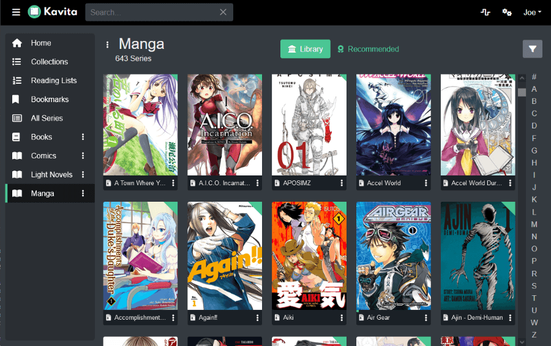

<!--
NB: Deze README is automatisch gegenereerd door <https://github.com/YunoHost/apps/tree/master/tools/readme_generator>
Hij mag NIET handmatig aangepast worden.
-->

# Kavita voor Yunohost

[](https://ci-apps.yunohost.org/ci/apps/kavita/)


[](https://install-app.yunohost.org/?app=kavita)

*[Deze README in een andere taal lezen.](./ALL_README.md)*

> *Met dit pakket kun je Kavita snel en eenvoudig op een YunoHost-server installeren.*  
> *Als je nog geen YunoHost hebt, lees dan [de installatiehandleiding](https://yunohost.org/install), om te zien hoe je 'm installeert.*

## Overzicht

Kavita is a fast, feature rich, cross platform reading server. Built with a focus for manga and the goal of being a full solution for all your reading needs. Setup your own server and share your reading collection with your friends and family.

### Features

- Extensive File support
- Manga/Comic Reader
- Book Reader
- User Management and Sharing
- Cross Platform with no dependencies - Everything in the box
- Full-text search to quickly find what you want to read
- Mixed media Libraries - Light Novels and Manga can be right next to each other
- Fast and efficient library scans. Don't perform I/O if the underlying file hasn't changed.
- OPDS-PS Support


**Geleverde versie:** 0.8.5.11~ynh1

**Demo:** <https://demo.kavitareader.com/>

## Schermafdrukken



## :red_circle: Anti-eigenschappen

- **Paid content**: Promotes or depends, entirely or partially, on a paid service.

## Documentatie en bronnen

- Officiele website van de app: <https://www.kavitareader.com/>
- Officiele beheerdersdocumentatie: <https://wiki.kavitareader.com/en>
- Upstream app codedepot: <https://github.com/Kareadita/Kavita>
- YunoHost-store: <https://apps.yunohost.org/app/kavita>
- Meld een bug: <https://github.com/YunoHost-Apps/kavita_ynh/issues>

## Ontwikkelaarsinformatie

Stuur je pull request alsjeblieft naar de [`testing`-branch](https://github.com/YunoHost-Apps/kavita_ynh/tree/testing).

Om de `testing`-branch uit te proberen, ga als volgt te werk:

```bash
sudo yunohost app install https://github.com/YunoHost-Apps/kavita_ynh/tree/testing --debug
of
sudo yunohost app upgrade kavita -u https://github.com/YunoHost-Apps/kavita_ynh/tree/testing --debug
```

**Verdere informatie over app-packaging:** <https://yunohost.org/packaging_apps>
