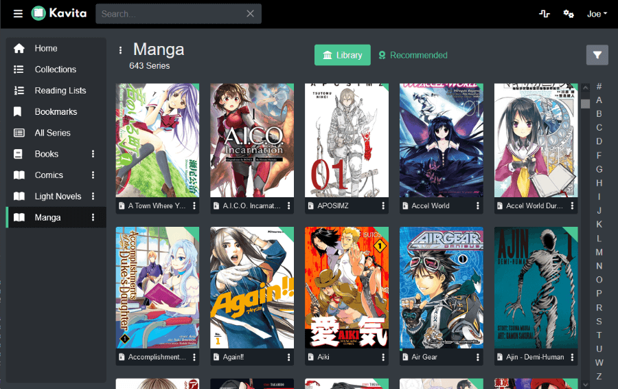

<!--
To README zostało automatycznie wygenerowane przez <https://github.com/YunoHost/apps/tree/master/tools/readme_generator>
Nie powinno być ono edytowane ręcznie.
-->

# Kavita dla YunoHost

[](https://ci-apps.yunohost.org/ci/apps/kavita/)


[](https://install-app.yunohost.org/?app=kavita)

*[Przeczytaj plik README w innym języku.](./ALL_README.md)*

> *Ta aplikacja pozwala na szybką i prostą instalację Kavita na serwerze YunoHost.*  
> *Jeżeli nie masz YunoHost zapoznaj się z [poradnikiem](https://yunohost.org/install) instalacji.*

## Przegląd

Kavita is a fast, feature rich, cross platform reading server. Built with a focus for manga and the goal of being a full solution for all your reading needs. Setup your own server and share your reading collection with your friends and family.

### Features

- Extensive File support
- Manga/Comic Reader
- Book Reader
- User Management and Sharing
- Cross Platform with no dependencies - Everything in the box
- Full-text search to quickly find what you want to read
- Mixed media Libraries - Light Novels and Manga can be right next to each other
- Fast and efficient library scans. Don't perform I/O if the underlying file hasn't changed.
- OPDS-PS Support


**Dostarczona wersja:** 0.8.4~ynh1

**Demo:** <https://demo.kavitareader.com/>

## Zrzuty ekranu



## :red_circle: Niepożądane funkcje

- **Paid content**: Promotes or depends, entirely or partially, on a paid service.

## Dokumentacja i zasoby

- Oficjalna strona aplikacji: <https://www.kavitareader.com/>
- Oficjalna dokumentacja dla administratora: <https://wiki.kavitareader.com/en>
- Repozytorium z kodem źródłowym: <https://github.com/Kareadita/Kavita>
- Sklep YunoHost: <https://apps.yunohost.org/app/kavita>
- Zgłaszanie błędów: <https://github.com/YunoHost-Apps/kavita_ynh/issues>

## Informacje od twórców

Wyślij swój pull request do [gałęzi `testing`](https://github.com/YunoHost-Apps/kavita_ynh/tree/testing).

Aby wypróbować gałąź `testing` postępuj zgodnie z instrukcjami:

```bash
sudo yunohost app install https://github.com/YunoHost-Apps/kavita_ynh/tree/testing --debug
lub
sudo yunohost app upgrade kavita -u https://github.com/YunoHost-Apps/kavita_ynh/tree/testing --debug
```

**Więcej informacji o tworzeniu paczek aplikacji:** <https://yunohost.org/packaging_apps>
